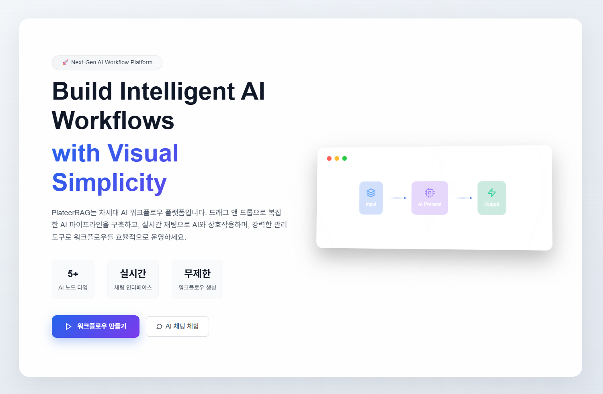
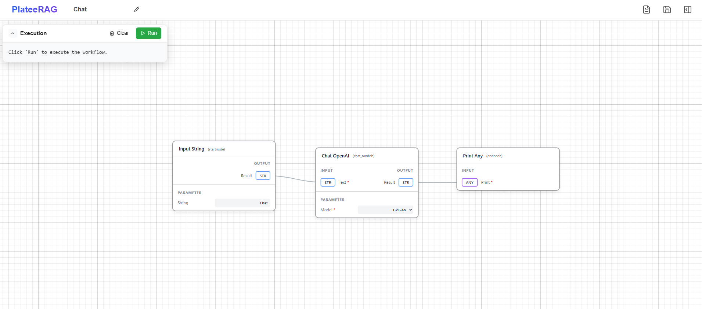
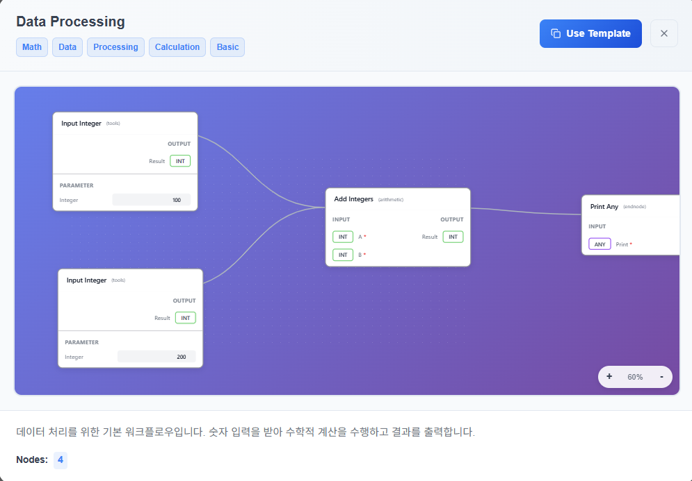
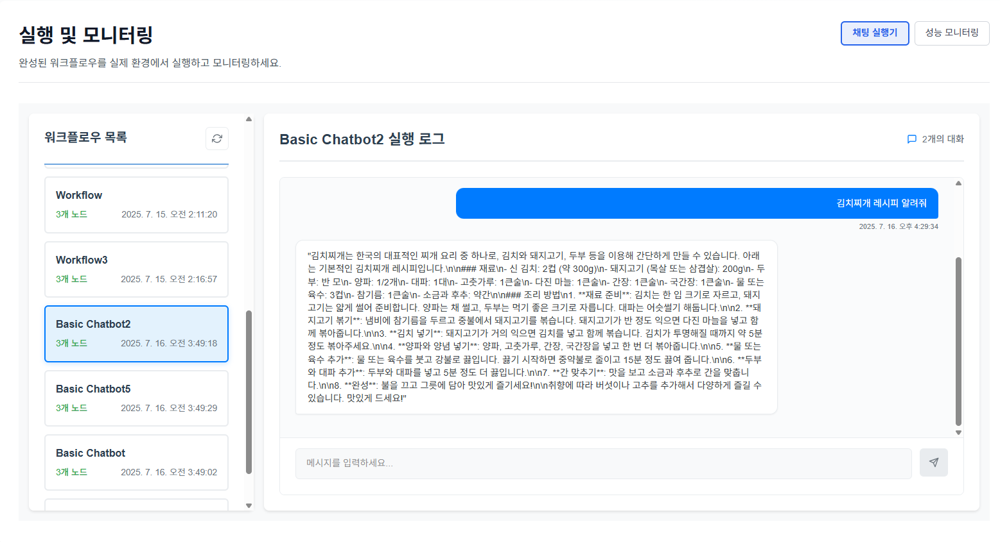
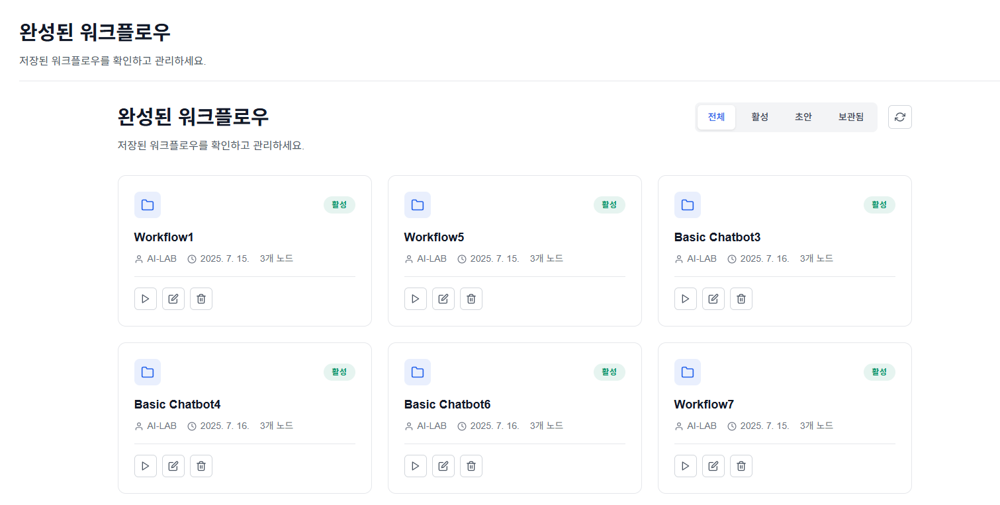
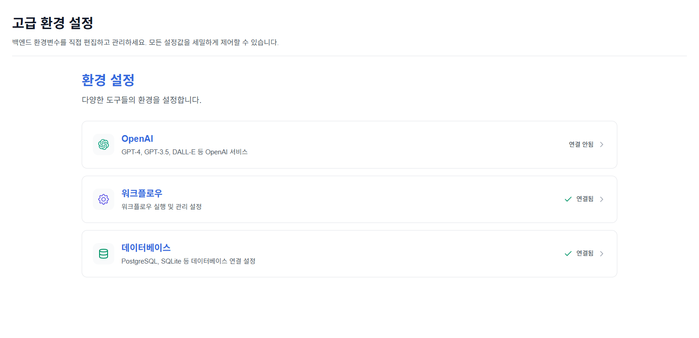

# 🚀 XGen

<div align="center">
  
</div>

<br />

> **Next-Generation AI Workflow Platform** - Build AI pipelines with drag-and-drop and interact in real-time

[](https://nextjs.org/)
[](https://reactjs.org/)
[](https://www.typescriptlang.org/)
[](https://sass-lang.com/)

XGen is an innovative platform that allows you to build AI applications with a **visual workflow editor**. You can design LangChain-based AI pipelines simply through **drag-and-drop** without complex coding, and communicate naturally with AI through **real-time chat**.

## ✨ Key Features

### 🎨 **Visual Canvas Editor**

<div align="center">
  
  <p><em>🖱️ Visually compose AI workflows with intuitive drag-and-drop interface</em></p>
</div>

- **LangChain Node Support**: Rich AI nodes including ChatOpenAI, ChatAnthropic, VectorStore
- **Drag & Drop**: Intuitive interface for workflow composition
- **Real-time Connections**: Visual representation of data flow between nodes
- **Auto Save**: Preserve work content with LocalStorage-based system
- **Template System**: Pre-built workflow templates provided

<div align="center">
  
  <p><em>⚡ Quickly start workflows with various templates</em></p>
</div>

### 💬 **AI Chat Interface**

- **Workflow Integration**: Real-time conversation with built workflows
- **Typing Animation**: Elegant UI for displaying AI responses
- **Multi-Workflow**: Select from multiple workflows for conversation
- **Chat History**: Save and manage conversation records
- **React Hot Toast**: Enhanced user experience with notification system

### 📊 **Integrated Management Center**

<div align="center">
  
  <p><em>💬 Test workflows and check chats directly in the management center</em></p>
</div>

- **Execution Monitoring**: Track workflow execution status and performance
- **Debug Tools**: Detailed logging system for development environment
- **Settings Management**: Global settings and API key management
- **Workflow Playground**: Test environment provided
- **Completed Workflows**: History management of executed tasks

<div align="center">
  
  <p><em>📈 Real-time workflow execution status and resource monitoring</em></p>
</div>

### ⚡ **High-Performance Architecture**

- **FastAPI Backend**: High-performance API server based on Python
- **Turbopack**: Fast bundler utilizing Next.js 15
- **Modular Design**: Scalable component-based structure
- **Type Safety**: Enhanced development productivity and stability with TypeScript

## 🏗️ Project Structure

```
plateerag/
├── src/
│   ├── app/
│   │   ├── page.tsx              # Main landing page
│   │   ├── layout.tsx            # Root layout
│   │   ├── globals.css           # Global styles
│   │   ├── HomePage.module.scss  # Homepage-specific styles
│   │   ├── config.js             # Configuration file (API_BASE_URL, etc.)
│   │   ├── canvas/               # 🎨 Visual workflow editor
│   │   │   ├── page.tsx          # Canvas main page
│   │   │   ├── types.ts          # Canvas type definitions
│   │   │   ├── components/       # Canvas core components
│   │   │   │   ├── Canvas.tsx    # Main canvas (ReactFlow-based)
│   │   │   │   ├── Node.tsx      # AI node component
│   │   │   │   ├── Edge.tsx      # Connection line component
│   │   │   │   ├── Header.tsx    # Canvas header (save/load)
│   │   │   │   ├── SideMenu.tsx  # Side menu container
│   │   │   │   └── ExecutionPanel.tsx # Workflow execution panel
│   │   │   ├── constants/        # Node definitions and constants
│   │   │   │   ├── nodes.js      # LangChain node data
│   │   │   │   └── workflow/     # Workflow templates
│   │   │   └── assets/          # Canvas styles (SCSS Modules)
│   │   ├── chat/                # 💬 AI chat interface
│   │   │   ├── page.tsx         # Chat main page
│   │   │   ├── components/      # Chat-related components
│   │   │   │   ├── ChatInterface.tsx    # Main chat UI
│   │   │   │   ├── ChatContent.tsx      # Chat content display
│   │   │   │   └── WorkflowSelection.tsx # Workflow selector
│   │   │   └── assets/          # Chat styles
│   │   ├── main/                # 📊 Integrated management center
│   │   │   ├── page.tsx         # Management center main
│   │   │   ├── components/      # Management tool components
│   │   │   │   ├── MainPageContent.tsx  # Main dashboard
│   │   │   │   ├── Sidebar.tsx          # Sidebar navigation
│   │   │   │   ├── ContentArea.tsx      # Content area
│   │   │   │   ├── Executor.tsx         # Workflow executor
│   │   │   │   ├── Monitor.tsx          # Execution monitoring
│   │   │   │   ├── Settings.tsx         # Settings management
│   │   │   │   ├── Playground.tsx       # Test environment
│   │   │   │   ├── ConfigViewer.tsx     # Configuration viewer
│   │   │   │   ├── CompletedWorkflows.tsx # Completed workflows
│   │   │   │   └── CanvasIntroduction.tsx # Canvas introduction
│   │   │   └── assets/          # Management center styles
│   │   ├── api/                 # 🔗 API client
│   │   │   ├── workflowAPI.js   # Workflow execution API
│   │   │   ├── chatAPI.js       # Chat API
│   │   │   ├── nodeAPI.js       # Node management API
│   │   │   └── configAPI.js     # Configuration API
│   │   ├── data/                # 📊 Data management
│   │   │   └── chatData.js      # Chat data model
│   │   ├── utils/               # 🛠️ Common utilities
│   │   │   ├── logger.ts        # Debug logger system
│   │   │   ├── generateSha1Hash.ts # Hash generator
│   │   │   └── debug-guide.js   # Debug guide
│   │   └── _common/             # Common components
│   │       └── components/
│   │           ├── ToastProvider.jsx    # Notification system
│   │           ├── nodeHook.ts          # Node management hook
│   │           ├── sidebarConfig.ts     # Sidebar configuration
│   │           └── workflowStorage.js   # Workflow storage
│   └── public/                  # Static files (icons, images)
├── package.json                 # Project configuration and dependencies
├── next.config.ts              # Next.js configuration
├── tsconfig.json               # TypeScript configuration
├── eslint.config.mjs           # ESLint configuration
├── postcss.config.mjs          # PostCSS configuration
├── DEBUG_GUIDE.md              # Debug system usage guide
└── README.md                   # Project documentation
```

## 🤖 Supported AI Nodes (Planned)

XGen supports various AI nodes from the **LangChain** ecosystem:

### 💬 **Chat Models**

- **ChatOpenAI**: Support for GPT-4o, GPT-4, GPT-3.5 Turbo
- **ChatAnthropic**: Claude model series
- **Temperature Control**: Control creativity and consistency
- **Stop Sequence**: Output control options

### 🔗 **Chains & Agents**

- **LLMChain**: Basic language model chain
- **ConversationChain**: Conversational chain
- **Agent**: Autonomous AI agent
- **Tools**: External tool integration

### 📚 **Memory & Storage**

- **VectorStore**: Vector-based document storage
- **Memory**: Conversation memory management
- **Document Loaders**: Load various document formats

### 🔄 **Utility Nodes**

- **Input/Output**: Data input/output nodes
- **Transform**: Data transformation nodes
- **Conditional**: Conditional branching nodes

## 🚀 Quick Start

### 1. Environment Requirements

- **Node.js** 18.17 or higher
- **npm**, **yarn**, **pnpm** or **bun**

### 2. Installation and Running

```bash
# Clone repository
git clone https://github.com/your-org/plateerag.git
cd plateerag

# Install dependencies
npm install
# or
yarn install

# Run development server
npm run dev
# or
yarn dev
```

### 3. Check in Browser

Meet XGen at [http://localhost:3000](http://localhost:3000)! 🎉

## 📖 Usage Guide

### 🎯 Creating Workflows

1. Access **Canvas Editor** (`/canvas`)
2. Select **AI Node** from left node panel
3. Place on canvas with **drag & drop**
4. Create **connections** between nodes to compose workflow
5. **Save** and **run test**

### 💬 Chatting with AI

1. Access **Chat Interface** (`/chat`)
2. Click **Select Workflow** button
3. Choose desired workflow
4. Start **natural language conversation**
5. Check AI responses in real-time

### 📊 Managing Workflows

<div align="center">
  
  <p><em>🎛️ Easily manage and control workflows with intuitive interface</em></p>
</div>

1. Access **Management Center** (`/main`)
2. Check execution status in **Performance Dashboard**
3. Analyze debugging information in **Execution Logs**
4. Optimize workflows in **Settings**

<div align="center">
  
  <p><em>⚙️ Conveniently manage all necessary settings in one place</em></p>
</div>

## 🛠️ Development Guide

### Script Commands

```bash
# Development server (using Turbopack)
npm run dev

# Production build
npm run build

# Run production server
npm run start

# Code linting
npm run lint

# Auto fix code
npm run lint:fix

# Code formatting
npm run format
```

### Tech Stack

#### 🎨 **Frontend**

- **Next.js 15.3.2**: Full-stack React framework based on App Router
- **React 19**: Utilizing latest React features (Concurrent Features, Server Components)
- **TypeScript**: Enhanced type safety and development productivity
- **SCSS Modules**: Component-based style encapsulation
- **React Icons**: Utilizing Feather Icons set
- **React Hot Toast**: Elegant notification system

#### 🔧 **Development Tools**

- **Turbopack**: Fast bundler for Next.js 15 (dev mode)
- **ESLint**: Code quality and consistency management
- **Prettier**: Automatic code formatting
- **Husky**: Quality management through Git hooks

#### 🌐 **Backend Integration**

- **FastAPI**: High-performance API server based on Python
- **LangChain**: Framework for AI chain composition
- **RESTful API**: Standard HTTP API communication

#### 📊 **Data Management**

- **LocalStorage**: Client-side data storage
- **React State**: Application state management
- **JSON**: Data serialization and API communication

### Coding Style

- Use **TypeScript** strict mode
- **ESLint + Prettier** automatic formatting
- Style encapsulation with **SCSS Modules**
- **Component-based** architecture

### 🔍 Debug System

XGen provides a **smart debug logger**:

```javascript
import { devLog, prodLog } from '@/app/utils/logger';

// Output only in development environment
devLog.log('Debug information');
devLog.error('Development error');

// Always output (for critical errors)
prodLog.error('Critical error');
```

#### Browser Console Control

```javascript
// Force enable debug logs
enableDebugLogs();

// Disable debug logs
disableDebugLogs();

// Reset to environment settings
resetDebugLogs();

// Check current environment info
checkEnvironment();
```

For detailed usage, refer to [`DEBUG_GUIDE.md`](DEBUG_GUIDE.md).

## 📸 Screenshot Gallery

<div align="center">

### 🎨 Canvas Editor


### 📊 Management Center


### ⚙️ Workflow Management


</div>

## 🌟 Main Pages

| Page           | Path      | Description                           |
| -------------- | --------- | ------------------------------------- |
| **Home**       | `/`       | Project introduction and main landing |
| **Canvas**     | `/canvas` | Visual workflow editor                |
| **Chat**       | `/chat`   | AI workflow chat interface            |
| **Management** | `/main`   | Workflow management and monitoring    |

## 🤝 Contributing

Thank you for contributing to the XGen project!

### How to Contribute

1. **Fork** this repository
2. Create **Feature branch** (`git checkout -b feature/amazing-feature`)
3. **Commit changes** (`git commit -m 'Add amazing feature'`)
4. **Push to branch** (`git push origin feature/amazing-feature`)
5. Create **Pull Request**

### Development Environment Setup

```bash
# Install development dependencies
npm install

# Setup pre-commit hooks
npm run prepare

# Check code quality
npm run lint
npm run format
```

## 📄 License

This project follows [GPL-3.0](LICENSE).

## 👥 Development Team

- **Plateer AI-LAB**
- **CocoRoF** - Jang Ha-ryeom
- **haesookimDev** - Kim Hae-su
- **SonAIengine** - Son Seong-jun (AI-LAB Part Leader)
- **daunle** - Lee Da-un

## 🔗 Related Links

- **GitHub Repository**: [XGen Repository](https://github.com/plateer/plateerag)
- **Development Documentation**: [`DEBUG_GUIDE.md`](DEBUG_GUIDE.md) - Debug system usage guide
- **Issue Reports**: Bug reports and feature requests through GitHub Issues
- **Tech Blog**: [Plateer Tech Blog](https://x2bee.tistory.com/)

---

<div align="center">

**Made with ❤️ by Plateer AI-LAB**

[⭐ Star this repo](https://github.com/X2bee/PlateeRAG) • [🐛 Report Bug](https://github.com/X2bee/PlateeRAG/issues) • [💡 Request Feature](https://github.com/X2bee/PlateeRAG/issues)

</div>
